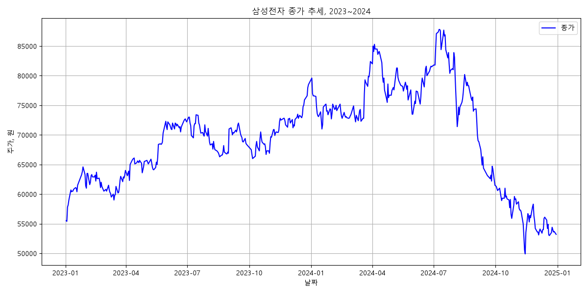
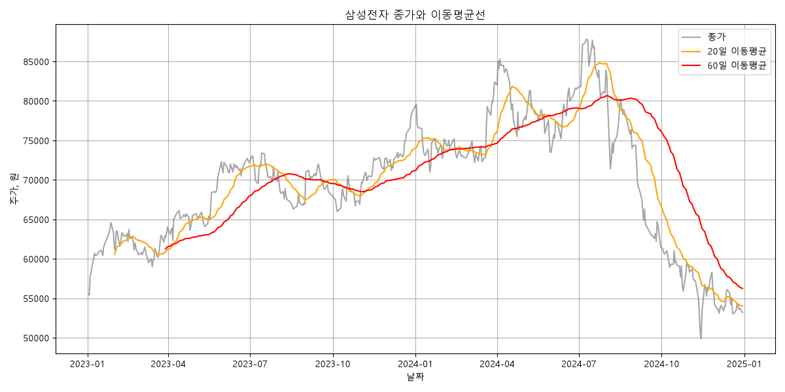
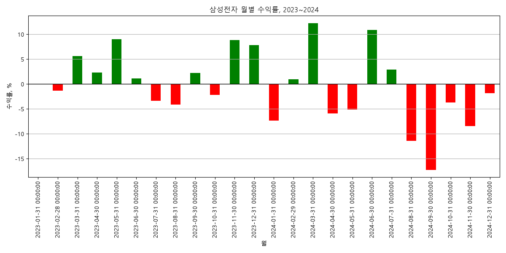

# 삼성전자 주가 시계열 분석

## 1. 프로젝트 개요

이 프로젝트는 Yahoo Finance에서 수집한 삼성전자 주가 데이터를 활용하여 2023년부터 2024년까지의 주가 흐름을 분석한 시계열 데이터 분석 프로젝트입니다.

주가의 전체적인 추세, 이동평균을 활용한 단기/중기 흐름, 월별 수익률 변화를 확인하는 것을 목표로 합니다.

본 프로젝트는 학습 목적의 데이터 분석이며, 투자 조언을 목적으로 하지 않습니다.

---

## 2. 분석 질문

본 프로젝트에서는 다음 질문을 중심으로 분석을 진행했습니다.

1. 2023년부터 2024년까지 삼성전자 주가는 전체적으로 어떤 흐름을 보였는가?
2. 20일 이동평균선과 60일 이동평균선을 비교했을 때 단기 흐름과 중기 흐름에는 어떤 차이가 있는가?
3. 월별 수익률을 기준으로 보았을 때 수익률이 높거나 낮았던 시기는 언제인가?

---

## 3. 데이터 분석 사고

데이터 분석을 시작하기 전에 먼저 데이터를 통해 무엇을 알고 싶은지 질문을 정의했습니다.  
본 프로젝트에서는 삼성전자 주가 데이터를 보고 다음과 같은 분석 질문을 설정했습니다.

| 구분 | 분석 질문 |
|---|---|
| 질문 1 | 2023년부터 2024년까지 삼성전자 주가는 전체적으로 상승 흐름이었는가, 하락 흐름이었는가? |
| 질문 2 | 20일 이동평균선과 60일 이동평균선을 비교했을 때 단기 흐름과 중기 흐름에는 어떤 차이가 있는가? |
| 질문 3 | 월별 수익률을 기준으로 보았을 때 수익률이 높거나 낮았던 시기는 언제인가? |

데이터 분석 과정에서는 결측치와 이상치를 확인하고, 분석에 영향을 줄 수 있는 데이터가 있는지 점검했습니다.

<table>
  <thead>
    <tr>
      <th width="100">구분</th>
      <th>의미</th>
      <th>처리 기준</th>
    </tr>
  </thead>
  <tbody>
    <tr>
      <td><b>결측치</b></td>
      <td>
        데이터에서 값이 비어 있는 경우를 의미합니다.
        예를 들어 날짜, 종가, 거래량 값이 비어 있으면 분석 결과가 부정확해질 수 있습니다.
      </td>
      <td>
        주요 컬럼의 결측치 여부를 확인하고, 분석에 필요한 값이 비어 있는 경우
        분석에서 제외하거나 정리했습니다.
      </td>
    </tr>
    <tr>
      <td><b>이상치</b></td>
      <td>
        일반적인 데이터 흐름에서 크게 벗어난 값을 의미합니다.
        예를 들어 주가가 0 이하이거나 거래량이 음수인 경우 비정상적인 값으로 볼 수 있습니다.
      </td>
      <td>
        종가와 거래량이 비정상적인 범위에 있는지 확인하고,
        그래프를 통해 지나치게 튀는 값이 있는지 점검했습니다.
        분석을 왜곡할 정도의 이상치는 발견되지 않아 별도의 제거는 수행하지 않았습니다.
      </td>
    </tr>
  </tbody>
</table>

---

## 4. 시계열 데이터 이해

시계열 데이터는 시간 순서에 따라 기록된 데이터입니다.  
삼성전자 주가 데이터는 날짜별로 종가, 거래량 등이 기록되어 있으므로 시계열 데이터에 해당합니다.

시계열 데이터에서는 트렌드, 계절성, 노이즈를 구분해서 이해하는 것이 중요합니다.

<table>
  <thead>
    <tr>
      <th width="100">개념</th>
      <th>설명</th>
      <th>본 프로젝트에서의 의미</th>
    </tr>
  </thead>
  <tbody>
    <tr>
      <td><b>트렌드</b></td>
      <td>
        데이터가 장기적으로 움직이는 전체적인 방향을 의미합니다.
      </td>
      <td>
        삼성전자 주가가 일정 기간 동안 상승하거나 하락하는 전체적인 흐름을 확인하는 데 사용했습니다.
      </td>
    </tr>
    <tr>
      <td><b>계절성</b></td>
      <td>
        특정 시간 주기마다 반복적으로 나타나는 패턴을 의미합니다.
      </td>
      <td>
        주가 데이터에서 매년 특정 시기마다 반복되는 흐름이 있는지 생각해볼 수 있습니다.
        본 프로젝트에서는 명확한 계절성보다는 월별 수익률 변화를 중심으로 확인했습니다.
      </td>
    </tr>
    <tr>
      <td><b>노이즈</b></td>
      <td>
        데이터에서 불규칙하게 나타나는 작은 변동을 의미합니다.
      </td>
      <td>
        주가는 매일 여러 요인에 의해 오르거나 내리기 때문에 일별 가격 변화에는 노이즈가 포함될 수 있습니다.
        이를 완화하기 위해 이동평균을 활용했습니다.
      </td>
    </tr>
  </tbody>
</table>

---


## 4. 사용 데이터

- 데이터 출처: Yahoo Finance
- 종목명: 삼성전자
- 티커: `005930.KS`
- 분석 기간: 2023-01-01 ~ 2024-12-31
- 데이터 단위: 일별 주가 데이터
- 데이터 파일:
  - `data/samsung_2023_2024.csv`
  - `data/samsung_cleaned.csv`
  - `data/monthly_return.csv`

주식 시장은 주말과 공휴일에는 거래가 없기 때문에 실제 데이터는 거래일 기준으로 구성되어 있습니다.

---

## 5. 프로젝트 구조

```text
samsung-stock-analysis/
│
├── analysis.py
├── REPORT.md
├── README.md
├── requirements.txt
│
├── data/
│   ├── samsung_2023_2024.csv
│   ├── samsung_cleaned.csv
│   └── monthly_return.csv
│
└── images/
    ├── 01_price_trend.png
    ├── 02_moving_average.png
    └── 03_monthly_return.png
```

---

## 6. 사용 기술 및 라이브러리

이 프로젝트에서는 다음 Python 라이브러리를 사용했습니다.

| 라이브러리 | 사용 목적 |
|---|---|
| pandas | 데이터 정제, 이동평균 계산, 수익률 계산 |
| matplotlib | 그래프 시각화 및 이미지 저장 |
| yfinance | Yahoo Finance 주가 데이터 수집 |

---

## 7. 실행 방법

### 1단계. 필요한 라이브러리 설치

터미널에서 아래 명령어를 실행합니다.

```bash
pip install -r requirements.txt
```

### 2단계. 분석 코드 실행

```bash
python analysis.py
```

코드를 실행하면 데이터 파일과 시각화 이미지가 생성됩니다.

---

## 8. 결과물

### 분석 리포트

- `REPORT.md`

분석 주제, 분석 질문, 데이터 설명, 결측치/이상치 처리 기준, 시각화, 인사이트, 결론 및 한계점, AI 사용 로그가 포함되어 있습니다.

### Python 코드

- `analysis.py`

데이터 수집, 전처리, 이동평균 계산, 월별 수익률 계산, 시각화 이미지 저장을 수행합니다.

## 시각화 결과

### 1. 삼성전자 종가 추세



### 2. 이동평균선 분석



### 3. 월별 수익률


---

## 9. 주요 분석 내용

본 프로젝트에서는 다음 분석을 수행했습니다.

1. 삼성전자 종가 추세 분석
2. 20일/60일 이동평균선 분석
3. 월별 수익률 분석

이를 통해 주가가 일정하게 움직이지 않고 상승과 하락을 반복했으며, 이동평균을 통해 단기 흐름과 중기 흐름을 구분할 수 있음을 확인했습니다.

---

## 10. 재현성 안내

이 프로젝트를 재현하려면 다음 파일이 필요합니다.

- `analysis.py`
- `requirements.txt`
- `data/` 폴더 또는 데이터 수집 가능한 인터넷 환경

필요한 라이브러리는 `requirements.txt`에 정리되어 있습니다.

---

## 11. 주의사항

- 본 분석은 학습 목적의 프로젝트입니다.
- 분석 결과는 투자 조언이 아닙니다.
- 주가 데이터만 사용했기 때문에 기업 실적, 금리, 환율, 반도체 업황, 뉴스 등 외부 요인은 충분히 반영하지 못했습니다.
- Yahoo Finance 데이터 사용 시 데이터 제공 정책과 라이선스를 확인해야 합니다.

---

## 12. 참고사항

- 데이터 출처: Yahoo Finance
- 사용 티커: `005930.KS`
